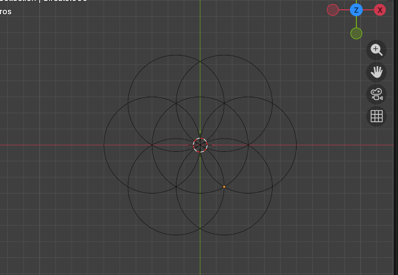

# Flor-de-vida
Creación de Flor de vida

Generación de la Figura “Flor de Vida” en Blender mediante Python

# 1.Introducción
Se desarrolló un script en Python dentro de Blender con el objetivo de generar automáticamente la figura geométrica conocida como “Flor de Vida”, aplicando principios trigonométricos y automatización de geometría.

## Objetivo

Construir de manera automática un patrón geométrico compuesto por un círculo central y seis círculos periféricos distribuidos simétricamente.

## Metodología

Se utilizó el módulo `bpy` para crear geometría dentro de Blender y el módulo `math` para realizar cálculos trigonométricos.

El procedimiento consistió en:

1. Limpiar la escena.
2. Definir el radio común para todos los círculos.
3. Crear un círculo central en el origen.
4. Generar seis círculos adicionales mediante un ciclo `while`.
5. Calcular la posición de cada círculo utilizando:

   * ( x = r \cos(\theta) )
   * ( y = r \sin(\theta) )
6. Incrementar el ángulo en intervalos de 60° para lograr una distribución uniforme.

## Resultados

El script generó correctamente la figura compuesta por siete círculos de igual radio:

* 1 círculo central.
* 6 círculos periféricos.
* Distribución angular uniforme cada 60°.

La figura obtenida presenta simetría radial y precisión geométrica.

## Conclusión

La automatización mediante scripting en Blender permite generar patrones geométricos con exactitud y eficiencia.
El uso de funciones trigonométricas facilitó la distribución uniforme de los círculos, demostrando la integración entre matemáticas y modelado digital.

